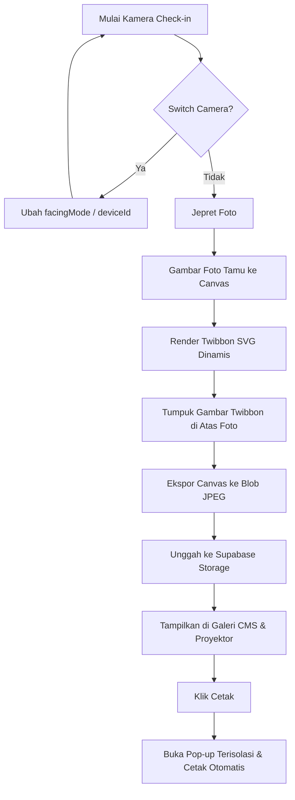

# Spesifikasi Desain: Fitur Twibbon Cetak Tamu & Perbaikan Statistik RSVP Nullable

Dokumen spesifikasi ini menjelaskan arsitektur, skema data, dan detail implementasi untuk menambahkan fitur kamera ber-Twibbon, pemindahan kamera depan/belakang (*Switch Camera*), fasilitas pencetakan langsung dari dashboard, serta migrasi status konfirmasi kehadiran menjadi nullable guna memisahkan kategori statistik dan filter secara presisi di aplikasi Undangan Pernikahan **Farhan & Tazkiah**.

---

## 1. Arsitektur & Logika Sistem

Sistem ini dibagi menjadi dua fokus area utama:

### A. Fitur Foto Tamu Ber-Twibbon & Sistem Cetak
Kamera check-in akan mengotomatiskan penempelan Twibbon langsung di sisi klien menggunakan HTML5 Canvas sebelum data dikirim ke penyimpanan cloud (Supabase Storage). Hal ini menjaga konsistensi visual di seluruh modul (Galeri CMS, Slideshow Proyektor, dll.).



### B. Arsitektur RSVP Nullable
Menghapus default kekakuan status boolean dengan mengizinkan tiga kondisi:
1. `rsvp_status = true` (Hadir)
2. `rsvp_status = false` (Tidak Hadir)
3. `rsvp_status = NULL` (Belum Konfirmasi)

---

## 2. Perubahan Skema Data & Migrasi Database

### A. SQL Migrasi Tabel `guests`
Kita akan memodifikasi kolom `rsvp_status` agar defaultnya bernilai `NULL` (bukan `false`), lalu merapikan data lama.

```sql
-- 1. Hapus default value 'false' dan set default menjadi NULL
ALTER TABLE guests ALTER COLUMN rsvp_status SET DEFAULT NULL;

-- 2. Rapikan data lama yang berstatus belum konfirmasi (message kosong dan belum check-in) ke NULL
UPDATE guests 
SET rsvp_status = NULL 
WHERE rsvp_status = false 
  AND message IS NULL 
  AND has_arrived = false;
```

---

## 3. Detail Komponen & Implementasi UI

### A. Integrasi Switch Camera & Canvas Twibbon (`AdminCMS.tsx`)

#### **1. State Baru**
```typescript
const [facingMode, setFacingMode] = useState<'user' | 'environment'>('environment');
```

#### **2. Switch Camera Logic**
```typescript
const toggleCameraFacing = () => {
  stopCameraStream();
  setFacingMode(prev => prev === 'user' ? 'environment' : 'user');
  // Memulai ulang kamera dengan facingMode baru di useEffect
};
```

#### **3. HTML5 Canvas Merging dengan Twibbon Dinamis**
Saat pengambilan gambar (`captureSnapshot`), kita akan menggambar foto tamu diikuti dengan template Twibbon SVG beresolusi tinggi (800x800 px) yang memuat nama mempelai secara dinamis:

```typescript
const twibbonImg = new Image();
twibbonImg.onload = () => {
  // 1. Gambar foto tamu asli
  ctx.drawImage(video, 0, 0, canvas.width, canvas.height);
  
  // 2. Gambar Twibbon di atasnya
  ctx.drawImage(twibbonImg, 0, 0, canvas.width, canvas.height);
  
  // 3. Ekspor ke Blob JPEG
  canvas.toBlob((blob) => {
    if (blob) setImageBlob(blob);
  }, 'image/jpeg', 0.8);
};
twibbonImg.src = `data:image/svg+xml;utf8,` + encodeURIComponent(getTwibbonSVGString("Farhan & Tazkiah", "19 Juni 2026"));
```

### B. Sistem Pencetakan Langsung (`handlePrint`)

Menambahkan fungsi cetak terisolasi yang meminimalkan gangguan visual pada dashboard operator:

```typescript
const handlePrintPhoto = (guest: any) => {
  if (!guest || !guest.photo_url) return;
  
  const printWindow = window.open('', '_blank', 'width=800,height=800');
  if (!printWindow) return;
  
  printWindow.document.write(`
    <html>
      <head>
        <title>Cetak Twibbon - ${guest.name}</title>
        <style>
          html, body {
            margin: 0;
            padding: 0;
            width: 100%;
            height: 100%;
            background: white;
            display: flex;
            align-items: center;
            justify-content: center;
          }
          .print-card {
            width: 100%;
            max-width: 600px;
            text-align: center;
            padding: 20px;
            box-sizing: border-box;
          }
          img {
            max-width: 100%;
            height: auto;
            border-radius: 12px;
            box-shadow: 0 4px 12px rgba(0,0,0,0.1);
          }
          p {
            font-family: serif;
            font-style: italic;
            color: #4A5D4E;
            margin-top: 15px;
            font-size: 14px;
          }
          @media print {
            body { background: white; }
            .print-card { padding: 0; }
            img { box-shadow: none; border-radius: 0; }
          }
        </style>
      </head>
      <body>
        <div class="print-card">
          
          <p>Terima kasih telah merayakan hari bahagia kami. <br><strong>— Farhan & Tazkiah</strong></p>
        </div>
        <script>
          window.onload = function() {
            window.focus();
            setTimeout(function() {
              window.print();
              window.close();
            }, 300);
          };
        </script>
      </body>
    </html>
  `);
  printWindow.document.close();
};
```

---

## 4. Rencana Pengujian

### **A. Pengujian RSVP Nullable**
* **Tamu Baru**: Verifikasi bahwa tamu baru yang ditambahkan secara otomatis memiliki status `NULL` pada kolom `rsvp_status`.
* **Pengisian Form**: Pastikan pengisian konfirmasi "Akan Hadir" menghasilkan status `true`, dan "Tidak Bisa Hadir" menghasilkan status `false`.
* **Statistik & Filter**: Verifikasi bahwa kartu statistik "Hadir", "Tidak Hadir", dan "Belum Konfirmasi" di dashboard menghitung jumlah dengan tepat dan penyaringan filter tabel berfungsi secara akurat.

### **B. Pengujian Kamera & Twibbon**
* **Switch Camera**: Uji tombol rotasi kamera pada iPad/HP untuk memastikan transisi antara kamera depan dan belakang berjalan lancar tanpa mengalami *crash* memori.
* **Canvas Composite**: Pastikan posisi foto tamu dan overlay Twibbon SVG sejajar sempurna di segala resolusi input kamera.
* **Cetak Foto**: Simulasikan tombol print di Galeri CMS dan modal Zoom untuk memverifikasi bahwa dialog cetak sistem terpanggil dengan tata letak visual terpusat yang rapi.
